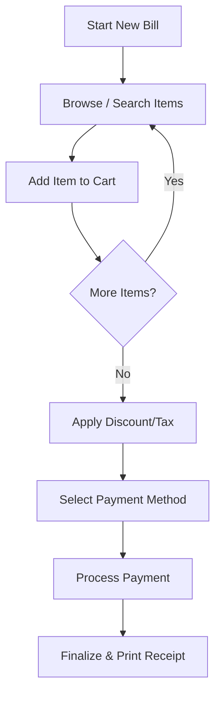
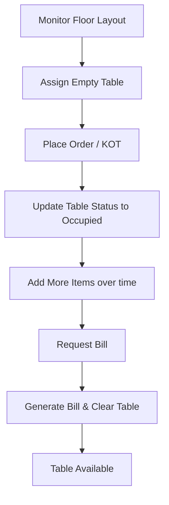
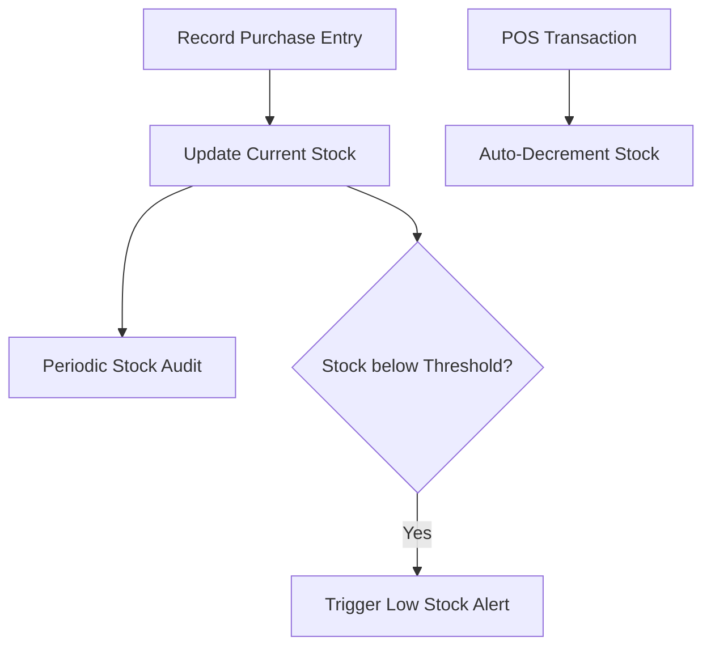

# APP_FLOW - FINBOOKS User Journeys

## 1. POS / Billing Flow

```mermaid
graph TD
    A[Start New Bill] --> B[Browse / Search Items]
    B --> C[Add Item to Cart]
    C --> D{More Items?}
    D -- Yes --> B
    D -- No --> E[Apply Discount/Tax]
    E --> F[Select Payment Method]
    F --> G[Process Payment]
    G --> H[Finalize & Print Receipt]
```

## 2. Table Management Flow (Dine-in)

```mermaid
graph TD
    A[Monitor Floor Layout] --> B[Assign Empty Table]
    B --> C[Place Order / KOT]
    C --> D[Update Table Status to Occupied]
    D --> E[Add More Items over time]
    E --> F[Request Bill]
    F --> G[Generate Bill & Clear Table]
    G --> H[Table Available]
```

## 3. Inventory Management Flow

```mermaid
graph TD
    A[Record Purchase Entry] --> B[Update Current Stock]
    B --> C[Periodic Stock Audit]
    D[POS Transaction] --> E[Auto-Decrement Stock]
    B --> F{Stock below Threshold?}
    F -- Yes --> G[Trigger Low Stock Alert]
```
